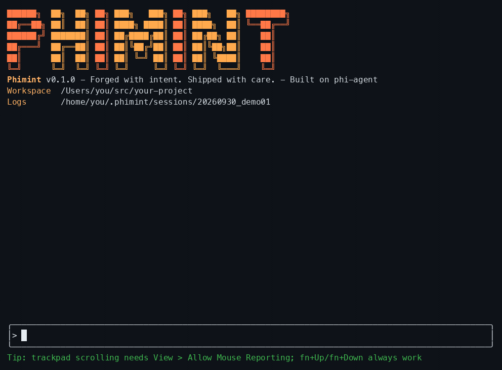

# phimint

**Pronounced** `/ˈfaɪmɪnt/` ("fie-mint", phi + mint) — a terminal AI coding agent built on [phi-agent](https://docs.phiagent.dev/), the agent runtime beneath it. *Not just good at chat — it gets the job done right.*

[](LICENSE)
[](https://www.rust-lang.org)
[](README_CN.md)



*phimint needs one API key in `~/.phimint/config.json` — a one-minute step, see [Quick start](#quick-start).*

phimint runs the full coding loop — understand the request, read the code, change multiple files, compile and test, iterate on failures.

## Features

- **Streaming TUI** — ratatui + crossterm: fixed bottom composer, token-by-token streaming, inline tool calls, live line-by-line shell output, approval popups, startup banner that detects your terminal's light/dark background.
- **Slash commands** — `.claude/skills`-compatible skills: `/skill-name args` injects the skill body into the turn. `/resume` reopens a previous session with an interactive picker.
- **Pull-based context** — `repo_map` (tree-sitter symbol/structure index) plus `search_content` (ripgrep). The agent searches and reads on demand instead of stuffing the whole repo into context.
- **LSP fast inner loop** — lazily started per-language servers (rust-analyzer, typescript-language-server, clangd); `file:line:col` diagnostics in seconds without recompiling. Falls back to shell when a server is missing.
- **Multi-agent fan-out, push-based fan-in** — `spawn_agent` sends sub-agents to investigate (read-only by default; write capability is requested per spawn when a task must edit). The main agent gets the **full reports at end of turn** (no polling). The TUI task panel tracks each sub-agent live; a 10-minute per-task hard timeout guarantees delivery.
- **Three approval modes** — `auto` (full auto), `ask` (prompt on writes/risky shell), `deny` (read-only). Sub-agents inherit the main agent's mode: in `ask`, every sub-agent write prompts in a popup that names the requesting sub-agent.
- **Guardrails** — reasoning-only spin correction, max-turns nudge, provider truncation guard (lying `finish_reason` tolerance, from agent-base), 16k tool-output cap.
- **Multi-language** — `code-intel` registry (extension → LSP server → build-command fallback): Rust, TypeScript, JavaScript, C, C++ out of the box.
- **Modular base** — chat UI components and language intelligence are distilled into their own crates: [`phi-tui`](https://github.com/hibuka-labs/phi-tui) (chat TUI components) and [`code-intel`](https://github.com/hibuka-labs/code-intel) (LSP/repomap/ripgrep cores). phimint keeps only the product shell.

## Quick start

Three steps to a running agent: install a prebuilt binary (**no Rust required**),
add an API key, run.

### 1. Install

Prebuilt binaries ship with every release (macOS / Linux / Windows, arm64 + x64).
One-liner (downloads to `~/.local/bin`; mainland China: use the Gitee line):

```bash
curl -fsSL https://github.com/hibuka-labs/phimint/releases/latest/download/install.sh | bash   # GitHub
curl -fsSL https://gitee.com/chenkangzeng_admin/phimint/releases/download/latest/install.sh | PHIMINT_MIRROR=gitee bash  # Gitee (China)
```

Windows (PowerShell):

```powershell
irm https://github.com/hibuka-labs/phimint/releases/latest/download/install.ps1 | iex   # GitHub
$env:PHIMINT_MIRROR='gitee'; irm https://gitee.com/chenkangzeng_admin/phimint/releases/download/latest/install.ps1 | iex  # Gitee (China)
```

Or use a package manager:

```bash
brew install hibuka-labs/phimint/phimint   # macOS / Linux (Homebrew)
npm install -g phimint                   # also: pnpm add -g phimint / yarn global add phimint
cargo install phimint                    # from crates.io
```

Upgrade: `phimint update` for one-liner installs, or `brew upgrade phimint` /
`npm install -g phimint@latest` / `cargo install phimint --force` — matching how
you installed. Mainland China users can download from
[Gitee Releases](https://gitee.com/chenkangzeng_admin/phimint/releases);
the updater falls back to the Gitee mirror automatically.

Uninstall: `phimint uninstall`. It removes the binary through whichever channel
installed it, then deletes `~/.phimint/` — your config (including the API key),
sessions, history and notes. `--keep-data` leaves that directory alone,
`--yes` skips the prompt. On Windows it also drops the PATH entry the installer
added.

### 2. Configure

A one-minute step: you need an API key for any supported model provider
(OpenAI / Anthropic / DeepSeek / Aliyun / Moonshot / Gemini / Ollama …).

Create `~/.phimint/config.json` (JSON5 — comments and trailing commas welcome):

```json
{
  "base_url": "https://api.openai.com/v1",
  "api_key": "sk-xxx",
  "main": "gpt-5.4-mini",
  "lite": "gpt-4o-mini",
  "advanced": "o1-preview"
}
```

Different provider per tier:

```json
{
  "main": { "model": "gpt-5.4-mini", "base_url": "https://api.openai.com/v1", "api_key": "sk-openai" },
  "lite": { "model": "deepseek-chat", "base_url": "https://api.deepseek.com/v1", "api_key": "sk-deepseek" },
  "advanced": { "model": "claude-opus-4", "base_url": "https://api.anthropic.com", "api_key": "sk-ant" }
}
```

Or pass everything on the command line (see `config.json.example` for the full schema):

```bash
phimint --model gpt-5.4-mini --base-url https://api.openai.com/v1 --api-key sk-xxx
```

### 3. Run

```bash
cd your-project && phimint
```

Type a task at the composer — e.g. `add a cached get_user function to the lib` —
and watch it read the code, edit, compile, and test until green. Keys, approval
modes, and a full walkthrough live under [Usage](#usage).

### Run from source

Requires a Rust toolchain (edition 2024). Optional: language servers on `PATH`
(rust-analyzer, typescript-language-server, clangd) for the LSP fast loop;
`cargo` / `npm` / `make` and friends for whatever project you point it at.
Everything else comes from crates.io — `cargo build` needs no sibling checkouts.

```bash
cargo run                                # run straight from the source tree
cargo run -- -w ../some-project          # point at another workspace
```

## Usage

```
phimint [OPTIONS] [COMMAND]

Commands:
  update             upgrade to the latest release (self-replaces standalone
                     installs; brew/npm/cargo installs get the matching upgrade
                     command instead). `phimint update --check` reports only.

  uninstall          remove phimint and the data it left behind. The binary goes
                     back to whichever channel installed it; then ~/.phimint/
                     (API key, sessions, history, notes) is deleted and the
                     Windows PATH entry the installer added is dropped.
                     --keep-data leaves ~/.phimint/ alone. --yes skips the prompt.

  -w, --workspace <PATH>       workspace directory (default: current directory)
      --model <NAME>           main model (overrides config.json)
      --lite-model <NAME>      lite model (overrides config.json)
      --advanced-model <NAME>  advanced model (overrides config.json)
      --base-url <URL>         API base URL (overrides config.json)
      --api-key <KEY>          API key (overrides config.json)
      --protocol <PROTO>       API protocol (default: inferred from model)
      --config <PATH>          config file path (default: ~/.phimint/config.json)
      --approval <MODE>        auto (default) / ask / deny
      --shell-timeout-ms <N>   shell command timeout (default 120000)
      --session <ID>           session ID (default: auto; reuse to append turns)
      --resume                 pick a previous session interactively
      --log-level <LEVEL>      session.log level (default info)
      --color-scheme <S>       banner colors: auto (default) / dark / light
      --banner <on|off>        startup banner (default on)
      --thinking-budget <N>    reasoning token budget (default 8192)
      --reasoning-effort <E>   none/low/medium/high/xhigh (default medium)
      --token-budget <N>       context-window token budget (default 210000)
      --session-retention-days <N>  days to keep session history (default 7)
      --no-update-check        skip the startup update check
```

### Interface & interaction

- **Composer & transcript** — fixed bottom composer (multi-line, bracketed paste, CJK double-width aware); output streams token-by-token with markdown rendering. Type `@` for file-path completion, `/` for the skill picker.
- **Keys**

  | Key | Action |
  |---|---|
  | `Enter` | send |
  | `Shift+Enter` | newline |
  | `Shift+Tab` | toggle approval mode (auto ⇄ ask) |
  | `Ctrl+O` | expand/collapse thinking blocks |
  | `Ctrl+Y` | copy the last reply |
  | `Ctrl+C` | context-sensitive: copy selection → cancel run → quit (press twice) |
  | `Ctrl+D` | quit |
  | `Esc` | clear selection, else clear the composer |
  | `PageUp` / `PageDown` | scroll the transcript |

- **Mouse** — wheel scrolls; left-drag selects lines; right-click opens a copy menu.
- **Approvals**

  | Mode | Behavior |
  |---|---|
  | `auto` | everything allowed; write-capable sub-agents write freely too |
  | `ask` | each write prompts: `y` allow once / `a` allow always / `n` deny |
  | `deny` | read-only; all writes rejected |

  `Shift+Tab` toggles `auto` ⇄ `ask` mid-session (the status bar shows the
  current mode); `--approval` picks the starting mode.

### A typical task

```
you: "add a cached get_user function to the lib"
1. repo_map for structure → search_content to locate → read_file the relevant code
2. edit_file / write_file the change
3. diagnostics for type errors in seconds (LSP fast loop, no recompile)
4. execute_command cargo check / tests → fix → rerun until green
5. summarize the diff and report
```

### A typical multi-agent run

```
you: "investigate questions X / Y / Z"
1. spawn_agent × 3 read-only sub-agents (each a narrow slice), main agent ends the turn
2. while they run, the main agent does nothing — reports are pushed, not polled
3. reports arrive batched at once (the task panel shows each sub-agent live)
4. the main agent synthesizes the findings and applies the edits itself — or, for independent work, spawns write-capable sub-agents on disjoint file sets
```

## Tool surface

| Tool | What it does |
|---|---|
| `read_file` / `write_file` / `edit_file` / `list_files` | file I/O and surgical edits (`edit_file` is atomic with 4-level matching; phi-kernel-tools) |
| `execute_command` | shell (builds/tests/anything; streamed line-by-line, timeout + cancel kills the process group) |
| `search_content` | ripgrep content search (regex) |
| `repo_map` | tree-sitter symbol/structure index (multi-language, pull-based context) |
| `diagnostics` | LSP diagnostics (fast loop without recompiling; degrades to shell) |
| `update_plan` | structured checklist for complex tasks (display-only, Codex-style; agent-base) |
| `spawn_agent` / `send_message` / `wait_agent` / `list_agents` / `close_agent` | sub-agent primitives (agent-works; preferred pattern: spawn, end turn, await push) |

## How it works

phimint is a consumer of the [`phi-agent`](https://docs.phiagent.dev/) framework: the agent loop, ReAct, approvals, session event stream and guards all come from the framework (one facade dependency). phimint brings the product shell — system prompt, tool registration, approval wiring, TUI.

- **Push-based fan-in** (agent-works) — sub-agent reports are held on completion and injected as a new turn the instant the main agent's turn ends; progress is display-only (never wakes or interrupts). A task over 10 minutes is hard-stopped with an Error result, so a hung child can always wake the parent. Sub-agents are read-only by default — `write_file` / `edit_file` / `execute_command` stay off their tool surface until write capability is requested for that spawn (`tools: "write"`, or a `coder`/`tester` preset). Write-capable children work disjoint file sets under a file lock (`file locked by <agent>` on collision), and in `ask` every child write is confirmed in a popup.
- **TUI architecture** — `ui/run.rs` runs a background task per agent turn pushing `RuntimeEvent`s over an mpsc channel; the main loop feeds events into the `App` state machine, polls keys and repaints. Input and events only meet through channels — no shared mutable state, zero intrusion into the agent loop.
- **Task panel** — `task_panel.rs` books sub-agent lifecycle (appears on spawn, flips on done, recycled 3s after completion, deferred while the root is busy or you're looking at the panel). Each sub-agent streams into its own buffer so interleaved output never cuts lines.
- **LSP** — `code-intel` lazily starts one server per language, syncs `didOpen`/`didChange`/`didSave` with cached `publishDiagnostics`, pulled by the `diagnostics` tool. The registry picks the server; code-intel knows nothing about phimint.
- **Guards** (framework-provided, product-tuned) — reasoning-only spin: two empty turns in a row injects an "act now" nudge and disables thinking; the end-of-turn judge fails open; `MaxTurnsNudgeMiddleware` forces a final answer in the last 3 turns of a 256-turn budget.

## Sessions & observability

Every run lands a session directory under `~/.phimint/sessions/<id>/`:

| File | Contents |
|---|---|
| `session.log` | tracing log (via log-core) |
| `turn_NNN.jsonl` | structured per-turn event stream (tool calls, text deltas, reasoning …) |
| `frames.txt` | flip-book of TUI frames (colors stripped, layout kept) for offline UI replay |
| `perf.log` | per-frame render-time CSV (performance regression hunting) |
| `session_metrics.json` | per-turn token usage and session totals (phi-telemetry) |

Re-running with `--session <id>` appends new turns to the same directory; `--resume` picks one interactively.

## Project structure

```
phimint/
├── src/
│   ├── main.rs        # CLI entry (clap), assembly, banner color detection
│   ├── agent.rs       # system prompt + tool registration + multi-agent/guard/approval wiring
│   ├── approval.rs    # two layers: ApprovalPolicy gate + decision handler (TUI queue)
│   ├── banner.rs      # startup banner (light + dark palettes)
│   ├── skills.rs      # thin Skill shell: agent-works skill subsystem + default dir policy
│   ├── tools/         # application tool shells (cores live in code-intel)
│   │   ├── diagnostics.rs   # LSP diagnostics tool
│   │   ├── repomap.rs       # repo_map tool
│   │   └── ripgrep.rs       # search_content tool
│   └── ui/            # TUI product shell (generic widgets live in phi-tui)
│       ├── run.rs             # main loop: terminal setup, event/command channels, turn runner
│       ├── app.rs (+tests)    # App state machine (event-driven)
│       ├── render.rs (+tests) # frame rendering
│       ├── task_panel.rs (+tests)   # sub-agent task panel
│       ├── child_results.rs (+tests)# fan-in result presentation
│       ├── frame_log.rs       # frames.txt + perf.log
│       └── handlers/          # keyboard.rs / mouse.rs / runtime.rs
└── Cargo.toml
```

## Development

```bash
cargo build            # compile
cargo test             # all tests (unit tests live in standalone *_tests.rs files)
cargo clippy           # lint
```

Tests are split from business code (module-separated tests): `app.rs`, `render.rs` and friends hold logic only; tests sit in `app_tests.rs` etc., `#[cfg(test)]`-isolated from production builds but still inside the crate, so `pub(crate)` members are reachable.

Dependencies are pure crates.io version references. To hack on a sibling crate (phi-agent, phi-tui, …) at the same time, add an uncommitted `[patch.crates-io]` path override (see [CONTRIBUTING.md](CONTRIBUTING.md)). Design notes live in `notes/` (local, not committed); `docs/` holds public-facing documentation and assets.

The README demo GIF is rebuilt from a recorded session: `cargo test frame_reel -- --ignored` writes ANSI frames to `target/reel/`, then `python3 scripts/readme_reel.py` renders them to `docs/assets/readme-demo.gif`.

## License

MIT — see [LICENSE](LICENSE).

## Contact

GitHub Issues — [hibuka-labs/phimint](https://github.com/hibuka-labs/phimint/issues)

[中文](README_CN.md)
